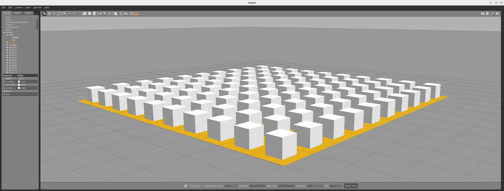
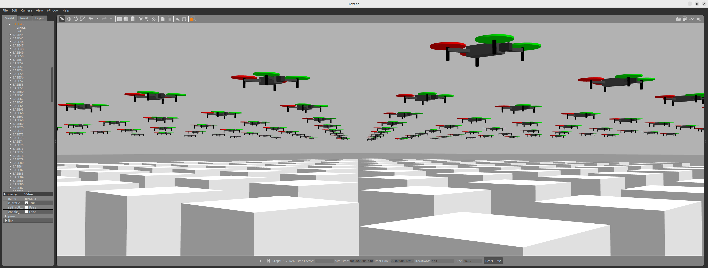
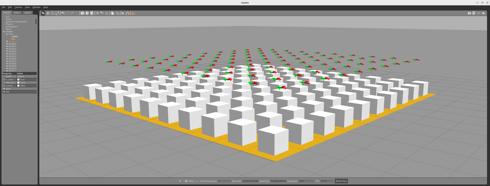

# 02: Running 100 drones

## Gazebo

First, we open a scenario in the Gazebo simulator:

```bash
cd
cd code/navsim/ws/src/navsim_pkg/worlds
gazebo tatami.world
```
An environment should open with a gaming area of 10x10 meters.


As in the previous tutorial, in a new terminal, verify that the ROS2 **/World** node is running correctly:
```bash
ros2 node list
```

Also verify that this node manages a service **/NavSim/DeployModel** for deploying objects in the area:
```bash
ros2 service list | grep NavSim
```

## Matlab

Now open Matlab (in the same computer or other computer connected to the same subnetwotk).
Navigate to `navsim/matlab/simulations/tutos/tuto2`. From here, open the script `OnHundredDrones.m` and execute it.

This code uses a **SimpleBuilder** object to generate 100 boxes in the area:

```matlab
builder  = SimpleBuilder ("builder" ,NAVSIM_MODELS_PATH);
for i=0:9
    for j = 0:9
        builder.DeployModel('DC/base_drone', ...
            ['BASE',num2str(i),num2str(j)], ...
            [i-4.5 j-4.5 0.26],[0 0 0]);
    end
end
```



### Synchronized fleet of aircraft

Now, we use a **USpaceOperator** object to generate 100 drones over the boxes:

```matlab
operator = USpaceOperator("operator",NAVSIM_MODELS_PATH);
for i=0:9
    for j = 0:9
        operator.DeployUAV(                ...
            UAVmodels.MiniDroneCommanded,  ...
            ['UAV',num2str(i),num2str(j)], ...
            [i-4.5 j-4.5 1],[0 0 0]);
    end
end
```


Once all elements have been deployed in the scenario, we reset the simulation time and begin issuing commands to the drones. 
The operator waits for `SimTime: 00 00:00:01.000` (1 second):

```matlab
operator.ResetSim;
operator.WaitTime(1);
```

Then, the operator instructs all drones to ascend at 0.5 m/s for one second.
The operator waits for the simulation to reach 5 seconds, allowing the drones to execute the maneuver and hover.

```matlab
for i=0:9
    for j = 0:9
        operator.RemoteCommand( ...
            ['UAV',num2str(i),num2str(j)], ...
            true,0,0,0.5,0,1);
    end
end
operator.WaitTime(5);
```



Once the drones are hovering in the air, the operator instructs them to perform a circular maneuver for 30 seconds, applying a linear velocity of 2 m/s and an angular velocity of 1 rad/s:

```matlab
for i=0:9
    for j = 0:9
        operator.RemoteCommand( ...
            ['UAV',num2str(i),num2str(j)], ...
            true,2,0,0,1,30);
    end
end
```
We can observe how the drones execute the maneuver perfectly synchronized, maintaining the distance between them.




### Fleet with unsynchronized aircraft colliding in mid-air

Now we are going to repeat the experiment, making slight modifications to the starting situation of the drones:
1) We close Gazebo and open it again with the _tatami.world_ scenario.
2) We modify the Matlab code so that the 100 deployed drones have a random initial orientation.

```matlab
operator = USpaceOperator("operator",NAVSIM_MODELS_PATH);
for i=0:9
    for j = 0:9
        operator.DeployUAV(                ...
            UAVmodels.MiniDroneCommanded,  ...
            ['UAV',num2str(i),num2str(j)], ...
            [i-4.5 j-4.5 1],[0 0 rand*2*pi]);
    end
end
```

3) We run the simulation.

It can be observed that, in this occassion, several drones collide in the air. Some of them manage to recover and continue the maneuver from another position, while others fall to the ground.


The goal of **USpace** is to provide compatible spatiotemporal paths, and for drones to be able to execute them precisely, to prevent such incidents from happening.

