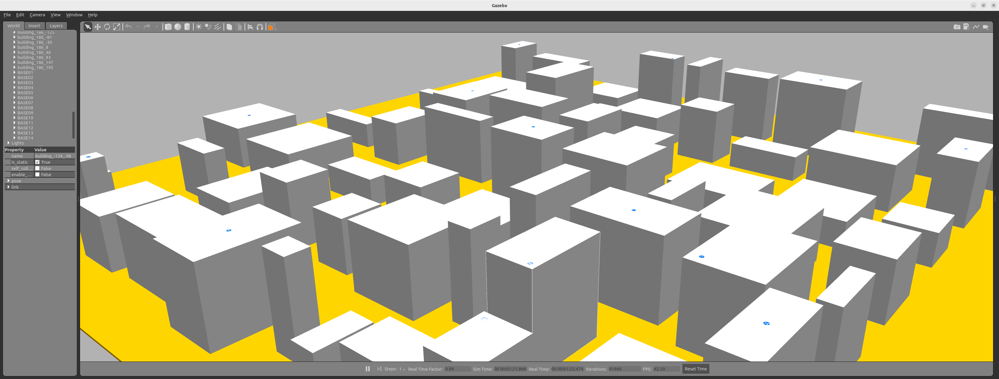
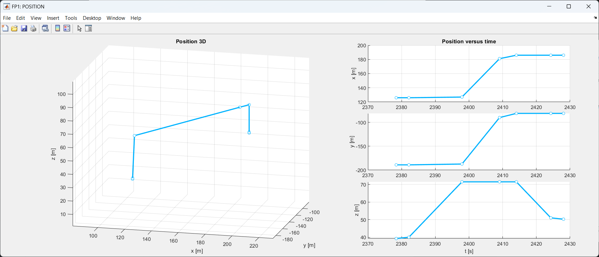

# 04: Generation of a fleet of autonomous drones operating in the city

## Gazebo

First, we open a scenario in the Gazebo simulator:

```bash
cd
cd code/navsim/ws/src/navsim_pkg/worlds
gazebo generated_city.world
```

Gazebo shows a small city of 500x500 meters in which blocks represent buildings.
You can zoom out to observe the whole city.
As in the previous tutorials, in a new terminal, verify that the ROS2 **/World** node is running a service **/NavSim/DeployModel** for deploying objects in the area:

```bash
ros2 node list
ros2 service list | grep Deploy
```

## Matlab

### CreateObject.m

Now open Matlab (in the same computer or other computer connected to the same subnetwotk).
Navigate to `navsim/matlab/simulations/tutos/tuto4`. From here, open the script `CreateObjets.m` and execute it.


This code employs a **SimpleBuilder** to deploy vertiports in the area, a **USpaceOperator** to manage the operation of several drones, and a **SimpleMonitor** to analyze their accuracy executing flight plans.

```matlab
builder  = SimpleBuilder ('builder' ,NAVSIM_MODELS_PATH);
operator = USpaceOperator('operator',NAVSIM_MODELS_PATH);
monitor  = SimpleMonitor('monitor');
```

First, we place a set of vertiports on the rooftops of several buildings. This time, we inform the operator about the existence of these vertiports.

```matlab
% -------------
% Set vertiports

%               x        y        z       rz
portsLoc = [ -190.00  -119.00  +048.00    pi/4
             -152.00  -106.00  +049.00    pi/4
             -134.00  -190.00  +048.00    00
             -092.00  -144.00  +041.00    00
             -074.00  -100.00  +043.00    00
             -073.00  +216.00  +027.00    00
             -007.00  +015.00  +043.00    00
             +060.00  +131.00  +032.00    00
             +180.00  +033.00  +050.00    00
             +186.00  -081.00  +050.00    pi/2
             -200.00  +157.00  +044.00    pi/2
             -200.00   +20.00  +042.00    pi/2
             +186.00  +195.00  +039.00    pi/2
             +126.00  -189.00  +039.00    pi/2
           ];


for i = 1:size(portsLoc,1)
   
    UAVid = sprintf('BASE%02d', i);
    builder.DeployModel('UAM/vertiport_H', UAVid, ...
        portsLoc(i,1:3), ...
        [0 0 portsLoc(i,4)]);
    operator.SetVertiport(UAVid,portsLoc(i,1:3),1);
end
```



Next, we configure the aircraft performance
and ask the **operator** to deploy a certain number of drones for us, not exceeding the number of available vertiports.

```matlab
% -------------
% Deploy fleet
info = UAVinfo('',UAVmodels.MiniDroneFP1);
info.velMax = 10;
operator.DeployFleet(size(portsLoc,1),info);
```


And finally, we instruct the **monitor** to store the telemetry information transmitted by each drone, 
and the operator to generate an operation for each drone:

```matlab
% -------------
% Begin operations
for UAVid = operator.FleetIds
    monitor.TrackUAV(UAVid); 
    operator.OperateUAV(UAVid);
end
```
Each operation starts from the vertiport where the drone is located, towards a randomly chosen destination vertiport (with the only restriction being that it must be different from the origin). The flight plan includes the drone ascending to a height of 70 meters (plus or minus 9 meters, depending on the course to follow), flying straight towards its destination, and descending vertically to land. The ascent and descent are performed at 2m/s. The cruising speed is 10m/s. 10 meters before completing the horizontal displacement, the drone reduces its speed to 2 m/s.




As soon as a drone informs the operator that it has completed the flight plan, the operator will assign it a new operation that will start 10 seconds later.


